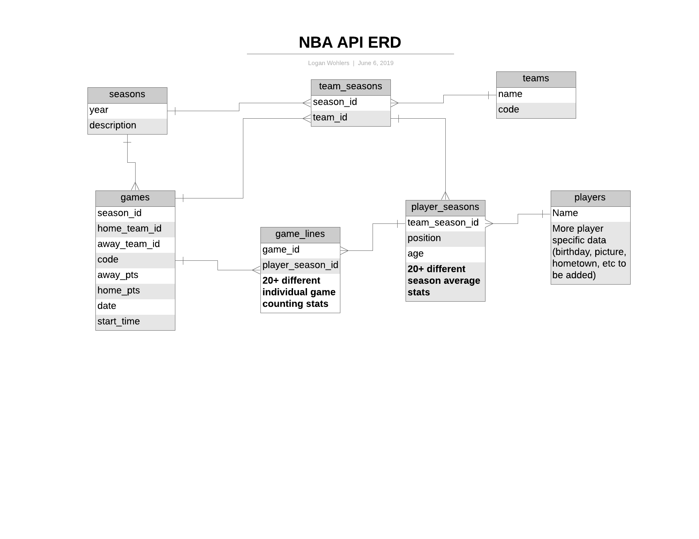

***NBA API***

View all box scores and player averages for recent NBA seasons in one place-- built by scraping seasonal data from basketball-reference.com.   Users can see graphical representations of players latest game trends and comparisons to other players and league averages.  The backend database for this project is in the process of being converted into an API for public use.  Backend is built in Rails using ActiveRecord ORM / PostgreSQL database-- frontend is built with React and Redux as well as the Victory library by Formidable to create dynamic graphs.

***How It Works***

Data was scraped from basketball-reference.com using the Nokogiri Ruby gem.  As data was scraped it is seeded into the database according to the following ERD diagram:

Some important things to note here:
-Players don't belong to a team-- rather they have many player_seasons each of which belongs to a team_season
-If a player is traded mid season to a different team and additional player_season is created-- thus one player can have multiple player_seasons throughout a season
-A game belongs to a "home_team" and an "away_team"- both of these are just team_seasons aliased under a different name
-For readability many of the columns in the player_season and game_line tables were left out.  These both contain roughly 20 additional columns of actual stats- with player_seasons focusing on various season averages and game_lines focusing on individual game statistics

